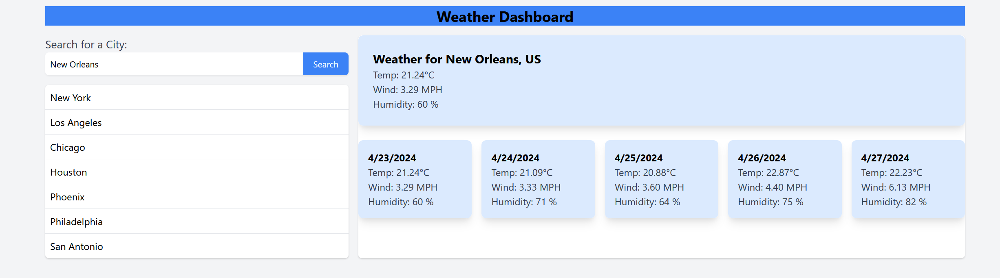

# 5 Day Weather Forecast

## Overview
The Weather Dashboard is a simple yet powerful web application that provides users with the current and forecasted weather conditions for cities worldwide. Leveraging the OpenWeatherMap API, it displays weather information such as temperature, humidity, wind speed, and a 5-day forecast, ensuring users have the data they need to plan their days effectively.

## Features
- **City Search**: Allows users to search for and select cities to view their current and upcoming weather conditions.
- **5-Day Weather Forecast**: Offers a detailed 5-day weather forecast, including temperature, weather conditions, and more.
- **Responsive Design**: Designed to work well on both desktop and mobile devices for a seamless user experience.
- **Data Persistence**: Utilizes `localStorage` to remember the user's last searched city and displays its weather data upon their return.

## Setup
To run this project locally, you'll just need a web browser and optionally a local server environment (like Live Server in Visual Studio Code) for a better development experience.

### Steps:
1. **Clone or download this repository** to your local machine.
2. **Open the project folder** in your favorite code editor.
3. **Launch the project**:
   - If you have a local server extension (e.g., Live Server on VSCode), right-click on the `index.html` file and select "Open with Live Server".
   - Alternatively, you can simply open the `index.html` file in your web browser directly from your file explorer.
4. **Obtain an API Key** from OpenWeatherMap by creating a free account and registering your application.
5. **Insert your API Key** into the `script.js` file where it says `YOUR_API_KEY`.

## Technology Stack
- HTML5
- CSS3 with TailwindCSS for styling
- Vanilla JavaScript for dynamic content and API requests
- OpenWeatherMap API for real-time weather data

## How to Contribute
Contributions are what make the open-source community such an amazing place to learn, inspire, and create. Any contributions you make are **greatly appreciated**.

1. Fork the Project
2. Create your Feature Branch (`git checkout -b feature/AmazingFeature`)
3. Commit your Changes (`git commit -m 'Add some AmazingFeature'`)
4. Push to the Branch (`git push origin feature/AmazingFeature`)
5. Open a Pull Request

## License
This project is open source and available under the [Open GNU](LICENSE).

## Acknowledgements
- [OpenWeatherMap API](https://openweathermap.org/api) for providing the weather data.
- [TailwindCSS](https://tailwindcss.com/) for the utility-first CSS framework that made styling more efficient.
